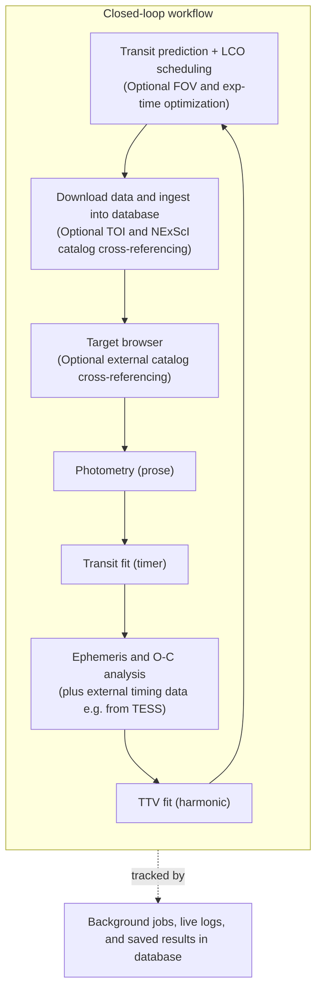

# muscatdb

<!--
#[](https://quicklook.readthedocs.io/en/latest/)
#[](https://pypi.org/project/muscatdb/)
#[](https://pypi.org/project/muscatdb/)
[](https://github.com/jpdeleon/muscatdb/actions/workflows/ci.yml)
-->
[](https://deepwiki.com/jpdeleon/muscatdb)

`muscat-db` is a web-based, closed-loop exoplanet observing and analysis workflow
that integrates a central database with semi-automated, reproducible photometry,
transit, ephemeris, and TTV analyses, enabling efficient LCO scheduling with
optional FOV and exposure-time optimization and integration with external TOI
and NExScI catalogs. Supported workflow pages expose a unique, shareable view state,
allowing configurations, selections, and results to be reviewed transparently,
reproduced consistently, and communicated easily among collaborators.

## Typical workflow



## Pipeline engines

muscat-db orchestrates three external packages, each in its own conda environment.
It stores their inputs, launches them as background jobs, and renders their outputs;
the science lives in the packages themselves.

| Stage | Engine | Sampler | Outputs |
|---|---|---|---|
| Photometry | [`prose2`](https://github.com/jpdeleon/prose2) | — | Lightcurve CSVs, diagnostics |
| Transit fitting | [`timer`](https://github.com/john-livingston/timer) | PyMC (NUTS) | Posteriors, corner/trace/fit plots |
| TTV fitting | [`harmonic`](https://github.com/john-livingston/harmonic) | emcee | Posteriors, corner/trace/fit plots |

## Requirements

- Python ≥ 3.12
- FITS files below the common data root (`MUSCAT_DATA_DIR`, default `/data`) in
  `MuSCAT`, `MuSCAT2`, `MuSCAT3`, `MuSCAT4`, and `Sinistro` subdirectories
- A writable obslog directory (`MUSCAT_OBSLOG_DIR`, default
  `$HOME/muscat/obslog`)

## Installation and usage

Choose either workflow below. Commands elsewhere in this README use the
installed `muscat-db` executable; when using `uv`, prefix those commands with
`uv run`.

<details>
<summary><strong>uv (recommended for repository development)</strong></summary>

Install the locked project environment from the repository root:

```bash
uv sync
```

Run the CLI or start the web interface inside that environment:

```bash
uv run muscat-db --help
uv run muscat-db serve
```

</details>

<details>
<summary><strong>pip</strong></summary>

Create and activate a virtual environment, then install the project in editable
mode:

```bash
python -m venv .venv
source .venv/bin/activate
python -m pip install -e .
```

Run the installed CLI or start the web interface:

```bash
muscat-db --help
muscat-db serve
```

</details>

## Configuration

All runtime configuration is read from environment variables; every variable has
a sensible in-code default, so muscat-db works out of the box. The canonical
registry lives in `src/muscat_db/config.py`, and `.env.example` documents each
one.

On import muscat-db auto-loads a `.env` file (via `python-dotenv`,
`find_dotenv` searching upward from the working directory). A `.env` is
**optional** — when absent, `load_dotenv` is a no-op and the defaults apply.
Copy the template only when you want to override a default or pin a value:

```bash
cp .env.example .env   # then edit
```

Variables the app and the jobs it spawns inherit include `MUSCAT_DB_PATH`,
`MUSCAT_DATA_DIR`, `MUSCAT_PROSE_DIR`, `MUSCAT_PROSE_PROJECT`,
`MUSCAT_PROSE_CONDA_ENV`, `MUSCAT_TIMER_DIR`, the `MUSCAT_PHOT_*` job-lifecycle
timeouts, `MUSCAT_TMPDIR`, `ASTROMETRY_NET_API_KEY`, `LCO_API_TOKEN`,
`MUSCAT_LCO_DIR`, `MUSCAT_LCO_ALLOW_SUBMIT`, `MUSCAT_DB_SECRET` (per-user LCO
token encryption), `MUSCAT_NGINX_GROUP` (htpasswd file group ownership), and
`MUSCAT_BOYLE_CATALOG` (optional TOI stellar-rotation catalog), and
`ADS_API_TOKEN`/`ADS_DEV_KEY` (target-page NASA ADS publication search) (see
below). At startup the server prints each registered variable's status
(`set` / `default` / `unset`).

`MUSCAT_DATA_DIR` is the common raw-data root, not one instrument's directory.
Each instrument resolves below it using its canonical case-sensitive directory
name, for example `$MUSCAT_DATA_DIR/MuSCAT3/<yymmdd>/`.

`MUSCAT_TMPDIR` (default `$HOME/temp`) routes the temp files of
spawned pipeline jobs (`TMPDIR`/`TMP`/`TEMP`) onto a roomy raid-backed directory,
avoiding `ENOSPC` failures when the root `/tmp` fills up.

Note: the auto-load covers the web app and the photometry/transit-fit jobs it
launches. **Manual** `run_photometry` invocations in the conda `prose` shell do
not import `muscat_db`, so set the shell directly (e.g.
`export TMPDIR="$HOME/temp"`) or `source .env` for those.

### WCS solving (muscat / muscat2 only)

muscat and muscat2 frames have no WCS in their headers, so the pipeline solves
astrometry during calibration. The method is selected per run with
`--wcs_method` (a **WCS method** selector is also exposed on the photometry page,
enabled only for muscat/muscat2):

- `twirl` — twirl + Gaia, **no API key needed** (default-safe choice).
- `nova` — nova.astrometry.net, **requires `ASTROMETRY_NET_API_KEY`**.

If `nova` is selected without the key set, calibration fails fast with a message
pointing you to `--wcs_method twirl`. BANZAI-reduced **muscat3 / muscat4 /
sinistro** already carry WCS in their headers and skip solving entirely, so the
API key is irrelevant for those instruments.

### TTV Fitting (harmonic)

Transit timing variation fits run on the **Ephemeris** page (`/ephemeris`), not on a
page of their own: a TTV signal is only meaningful relative to a reference linear
ephemeris, so the fit is the last step of the O-C workflow rather than a separate
destination. The **Configure & Run TTV Fitting** panel appears once a target has
transit times to fit; `/ttv-fit` redirects to `/ephemeris` for old bookmarks.

The engine is the [`harmonic`](https://github.com/john-livingston/harmonic) package,
which fits the multi-harmonic near-resonant TTV model of Lithwick, Xie & Wu (2012)
with `emcee`. Transit centers come straight from the O-C plot above the panel, so the
same dataset checkboxes and point exclusions that shape the linear fit also shape the
TTV fit. muscat-db writes harmonic's two inputs into the run directory and invokes the
CLI from the conda `harmonic` env:

- `data.csv` — the transit times (`planet,epoch,tc,tc_unc`), with planet letters
  remapped to the integer indices harmonic expects.
- `config.ini` — an `[INIT]` section with the TTV amplitude, super-period, and phase
  reference (`a_bc`, `a_cb`, `per_bc`, `t_bc`) for each adjacent pair, plus optional
  `[T14]` (transit durations) and `[OUTER]` (non-transiting outer planet) sections.

Sampler settings (walkers, steps, burn-in, thinning, processes, seed) and model options
(stellar mass, non-transiting outer planet, per-pair phase offsets, overwrite) are
exposed in the panel and map one-to-one onto harmonic's flags; the exact command is
shown and copyable so a run can be reproduced in a terminal. Runs are launched in the
background, tracked on the **Jobs** page, and stream their log live like photometry and
transit-fit jobs.

Results are keyed on **target alone** (not instrument/date, unlike photometry) and
stored under `$MUSCAT_TTV_DIR/<target>/_runs/<run_name>/` (default `$MUSCAT_TTV_DIR`
is `$HOME/ql/harmonic`), mirroring the photometry `_runs/` convention. Each run holds
`samples.csv.gz` (the posterior), `harmonic.log`, `meta.yaml` (muscat-db and harmonic
versions plus the full option set), the `data.csv`/`config.ini` inputs, and harmonic's
plots (`corner.png`, `trace.png`, `fit.png`, `init.png`). Naming a run keeps it
isolated; the page's run chips switch between stored runs, and **Delete Results** is
scoped to the run currently on screen. A run directory without `samples.csv.gz` is
treated as empty and hidden.

### LCO Scheduling, Archive Downloads, and FOV Optimization

The `/lco` page integrates with the LCO Observation Portal for scheduling
MUSCAT and Sinistro observations, optimizing pointing offsets/orientations, and downloading
reduced data from the LCO archive (requires funpack: "apt install libcfitsio-bin"). 
The feature is split into three workflows:

- **Schedule Observations**: Load your proposals, select target and planet, 
  generate batch transit windows across a UTC date range, configure imaging 
  (MUSCAT g/r/i/z or Sinistro filter), run a dry-run IPP check, and submit 
  observations. The scheduler page includes **Show FOV** and **Show Exp** shortcuts
  to pre-populate pointing offsets and exposure calculations for the target.
- **Field-of-View (FOV) Optimization (`/fov`)**: Optimize the telescope pointing
  center offset and Position Angle (PA) to capture the maximum number of useful,
  non-saturated comparison stars from Gaia DR3 while keeping the science target
  inside the instrument footprint (safely away from edges). An optional "avoid
  brighter than" Gmag threshold steers the pointing away from any star that
  would risk saturation or bleed if it fell inside the footprint; if no
  pointing can satisfy the constraint the page reports why.
- **Download LCO Data**: Filter archive frames by proposal, target, site, 
  instrument, reduction level, and date range, then download selected files 
  server-side.

For nginx deployments, each authenticated user should save their own LCO API
token from [their LCO profile](https://observe.lco.global/accounts/profile) on
the muscat-db `/settings` page. Per-user tokens are encrypted in SQLite, so the
server must have a stable `MUSCAT_DB_SECRET`:

```bash
export MUSCAT_DB_SECRET="replace-with-a-long-random-secret"
```

You can also export `MUSCAT_DB_SECRET` from `~/.bashrc` if you start
`muscat-db` from that shell. For `systemd`, cron, or any other non-interactive
launcher, define it in the service environment or in the repo `.env` file
instead.

The legacy server-wide fallback still works when no per-user token is saved:

```bash
export LCO_API_TOKEN="your-token-here"
```

Downloaded files are saved under `MUSCAT_LCO_DIR/<instrument>/<date>/` (default 
is `MUSCAT_DATA_DIR`'s per-instrument layout). Live observation submission 
requires an additional safety gate:

```bash
export MUSCAT_LCO_ALLOW_SUBMIT=1  # Only set when intentionally going live
```

The page is linked from the navigation bar and also reachable via 
`/lco?view=<slug>` after saving an ephemeris view on the **Ephemeris** page.
Repeating (`REPEAT_EXPOSE`) requests are validated against target
observability over the full padded request window (not just the bare transit)
before a dry-run or live submission is attempted, so an unobservable window
is rejected with a specific reason instead of failing at LCO. The scheduler
form and the `/toi`/`/nexsci` catalog filters are all bookmarkable: current
selections are encoded into the URL hash (e.g.
`/lco/schedule#proposal=TOM00001234&target=TOI-2000&kind=muscat3`) and take
priority over `localStorage` on load, so a saved or shared link reproduces
the exact view.

### Multi-User Deployment (nginx)

For a shared server with multiple observers, `muscat-db` can run behind an
nginx reverse proxy that performs HTTP Basic Auth and forwards the
authenticated username so jobs and settings are attributed per user. The
intended local port layout is:

```text
browser/SSH tunnel -> nginx 127.0.0.1:8000
                   -> muscat-db 127.0.0.1:8001
                   -> companion apps such as TESS quicklook 127.0.0.1:5000
```

The TESS QuickLook companion application is exposed through muscat-db at
`/tess-quicklook`, including nested HTTP routes and WebSocket connections. Its
backend defaults to `http://127.0.0.1:5000`; override it with
`MUSCAT_QUICKLOOK_URL` when the local service uses another loopback port:

```bash
export MUSCAT_QUICKLOOK_URL="http://127.0.0.1:5001"
```

For security, this setting accepts loopback hosts only (`127.0.0.1`, `::1`, or
`localhost`). The companion application must honor `X-Forwarded-Prefix` (or an
equivalent script-root setting) so generated links remain under
`/tess-quicklook`.

For a first-time setup, run the installer from the repository root. It installs
nginx and OpenSSL, enables `deploy/nginx.conf`, creates the protected htpasswd
file, and starts nginx:

```bash
sudo bash deploy/setup-nginx.sh
```

The installer creates an empty htpasswd file, so add at least one user before
opening the site. Otherwise, the browser will repeatedly ask for credentials
because nginx cannot accept any login. Use the built-in CLI rather than editing
the file by hand:

```bash
sudo env "PATH=$PATH" uv run muscat-db htpasswd add <username>
sudo env "PATH=$PATH" uv run muscat-db htpasswd add <username> --password-stdin
sudo env "PATH=$PATH" uv run muscat-db htpasswd delete <username>
sudo env "PATH=$PATH" uv run muscat-db htpasswd list
```

Launch the application in the `muscatdbgui` tmux session so it remains attached
to the server's normal operational session:

```bash
tmux new-session -s muscatdbgui       # omit if the session already exists
# Run inside the tmux session, from the repository root:
uv run muscat-db restart --nginx --reload
```

`--nginx` binds uvicorn to `127.0.0.1:8001`; nginx owns port `8000`. Do not add
`--port 8000`, because nginx mode deliberately overrides the application port.
Verify the listeners and connect through an SSH tunnel:

```bash
ss -ltn | grep -E ':8000|:8001'
ssh -L 8000:localhost:8000 <user>@<server>
# Then open http://localhost:8000 in a browser.
```

The auth middleware only honors the `X-Forwarded-User` header nginx sets
after a successful login when the request's immediate TCP peer is the
loopback socket, so binding without `--nginx` (e.g. `--host 0.0.0.0`) cannot
be tricked into accepting a spoofed header from the network. The htpasswd
file is written `0640 root:www-data` (override the group with
`MUSCAT_NGINX_GROUP`) so other local accounts on the shared server cannot
read and offline-crack the password hashes, and `htpasswd add` pipes the
password over stdin to `openssl passwd` rather than as an argument, so it
never appears in `ps`/`/proc`.

Each authenticated user is attributed on the **Jobs** page (`User` column)
for the photometry and transit-fit runs they launch, and gets an isolated,
encrypted LCO token via the `/settings` page (see above).

## CLI Usage

### Scan a single date

```bash
muscat-db scan muscat3 260423
```

### Scan all dates in a year that don't have CSVs yet

```bash
muscat-db scan-missing muscat4 26
muscat-db scan-all 26          # all instruments
```

### Scan yesterday (cron target)

```bash
muscat-db scan-yesterday
```

### Print a summary

```bash
muscat-db summary muscat3 260423 0
```

### Build the SQLite database from all CSVs

```bash
muscat-db build-db
```

### Start the web frontend

```bash
muscat-db serve              # http://0.0.0.0:8000
muscat-db serve --port 8080  # custom port
```

## Web Frontend

The navigation bar links the observation log, photometry, transit fitting, ephemeris
(O-C plots and TTV fitting), job history, exposure calculator, LCO scheduling/download,
field-of-view optimizer, the TOI and NExScI catalog browsers, and pipeline guide.
Observation-log navigation is **Logs** → **Dates** → **CCD summaries** → 
**Per-frame table**.

- **Transit Fitting Run Modes**: When launching transit fits, choose between a **New Fit** (start fresh, clobbering existing traces) or **Continue Sampling** (load the previous trace and append more MCMC draws, available if previous results exist). A **Secondary eclipse** checkbox fits an eclipse at orbital phase 0.5 instead of a primary transit.
- **Download all output**: Photometry, transit-fit, and TTV-fit result pages offer a single button that zips every product file for that run (recursively, for run-scoped reductions) server-side and streams it back for download.
- **Exposure calculator**: MuSCAT calculations report a separate recommended exposure time for each band, conservatively limited by the target and any selected comparison stars. Stored calibration coefficients can be inspected as a table or plotted against focus by band for either coefficient or FWHM.
- **Sinistro telescope selection**: Photometry can be filtered by LCO site, physical telescope (`TELESCOP`), and readout mode. When a target/date contains multiple physical telescopes, a telescope must be selected before reduction so frames from different cameras are not combined into one run.
- **Field-of-View (FOV) Optimizer**: Accessible from the navbar or observation scheduler to plan pointing offsets and instrument position angle (PA) based on Gaia DR3 comparison star heuristics, with an optional bright-star avoidance constraint.
- **Ephemeris O-C Export Headers**: Exported O-C ephemeris text starts with descriptive `#` comments specifying the BJD_TDB time standard and column formats (planet, epoch, tc, tc_unc) for easy external parsing. Each ephemeris field (RA/Dec, T0, period, duration) carries a provenance badge (NASA/TOI/AUTO/LINEAR/FIT/manual) and hand-entered values are preserved across a same-target re-fetch instead of being overwritten by a catalog miss.
- **TTV Fitting**: The same page runs multi-harmonic TTV fits on the transit times behind the O-C plot via the `harmonic` package, with named runs, live logs, and per-run results (see [TTV Fitting](#ttv-fitting-harmonic) above).
- **Catalog browsers (`/toi`, `/nexsci`)**: Interactive Plotly scatter plots of the TESS Objects of Interest (`data/TOIs.csv`) and the NASA Exoplanet Archive composite planet table (`data/nexsci_pscomppars.csv`), with configurable axes, filter chips (including a fast-rotator chip driven by the Boyle+2026 stellar-rotation catalog on `/toi`), a searchable table, CSV export, and bookmarkable filter state via the URL hash. Targets already in muscat-db are drawn as ★ stars. On the **NExScI** page, clicking a point opens that planet's muscat-db target page when the host is in the database, otherwise its [NASA Exoplanet Archive overview](https://exoplanetarchive.ipac.caltech.edu/overview/) page (using the archive's canonical host name, e.g. `TOI-2000`).
- **NASA ADS publications panel**: The target page can search NASA ADS for papers matching the target name (requires `ADS_API_TOKEN`/`ADS_DEV_KEY` in `.env`) and lists matching bibcodes with links to the abstract.

The home page shows:

- **Instrument cards** for every configured instrument (cards mark which ones already have data ingested).
- **Targets table** aggregated from all frames, with one row per OBJECT and columns:
  `Target · RA · Dec · Filters · Airmass · # Frames · Instruments · Dates`.
- **Search bar** that filters the targets table in real time. Plain-text substring by default, with optional regex and case-sensitive toggles. Invalid regex is reported inline.
- **Light / dark theme toggle** in the navbar (sun/moon icon, persisted via `localStorage`).
- **Loading status bar** at the top of the page plus a bottom status line showing `Rendering N targets…` while the table lays out.
- Inline SVG **favicon** (no extra HTTP request).

Photometry, transit-fit, and TTV-fit runs execute in the background and remain
recorded on the **Jobs** page. A photometry process that exits successfully but reports
`photometry PARTIAL FAILURE` is shown as failed, because one or more requested
bands did not complete. Hiding a job is local to the browser; starting that job
again makes its row visible.

Photometry run logs are isolated by instrument, date, and target. Transit-fit
outputs are stored under `$MUSCAT_TIMER_DIR/<instrument>/<date>/<target>/`
(default `$MUSCAT_TIMER_DIR` is `$HOME/ql/timer`), and TTV-fit outputs under
`$MUSCAT_TTV_DIR/<target>/_runs/<run_name>/` (default `$HOME/ql/harmonic`). Spaces are
removed from the target directory name; empty names and names containing `..`, `/`,
or `\` are rejected.

Calibration and engineering frames (`DARK*`, `FLAT*`, `BIAS*`, `MOVIE`, `FOCUS_ADJUST`, `FoV`, `Muscat commissioning *`, etc.) are excluded from the targets aggregation so the table only shows real science targets.

Fonts, icons, theme, and search are local or inlined. The **Guide** page loads
Mermaid from jsDelivr to render detailed workflow diagrams for each pipeline stage.

## API Documentation

Interactive API references are auto-generated from the OpenAPI schema of the FastAPI endpoints:

- **Swagger UI**: Available at `/docs` (e.g., [http://localhost:8000/docs](http://localhost:8000/docs)) to interactively test endpoints.
- **ReDoc**: Available at `/redoc` (e.g., [http://localhost:8000/redoc](http://localhost:8000/redoc)) for a clean, documentation-focused layout.

For an alternative modern documentation interface with client code snippet generators, you can also serve a custom wrapper using **Scalar** via CDN integration referencing `/openapi.json` (see [docs/audit_api.md](docs/audit_api.md) for details).

## Cron (daily)

```cron
0 6 * * * cd /path/to/muscat-db && .venv/bin/muscat-db scan-yesterday && .venv/bin/muscat-db build-db
```

## Architecture

```
CLI (typer)
├── scan         → scanner.py    → reads FITS headers (astropy), writes CSV
├── summary      → summarizer.py → groups frames by OBJECT/EXPTIME/READ_MODE
├── build-db     → database.py   → walks CSVs → SQLite (frames + summaries)
└── serve        → web.py        → FastAPI + Jinja2 → browser
```

## Naming conventions

The project uses four related names in different technical contexts. Keep these
spellings consistent when writing documentation, commands, imports, or paths:

| Context | Canonical name |
|---|---|
| Product and repository | `muscatdb` |
| Python import package | `muscat_db` |
| CLI command and Python distribution | `muscat-db` |
| SQLite database file | `muscat.db` |

### Instrument support

| Instrument | CCDs | FITS prefix | Data dir |
|---|---|---|---|
| muscat  | 3 | `MSCT`   | `/data/MuSCAT`   |
| muscat2 | 4 | `MCT2`   | `/data/MuSCAT2`  |
| muscat3 | 4 | `ogg2m001-` | `/data/MuSCAT3` |
| muscat4 | 4 | `coj2m002-` | `/data/MuSCAT4` |
| sinistro | 1 | `*` (any LCO 1m site) | `/data/Sinistro`  |

Sinistro scans the reduced `*e91.fits` frames produced by LCO BANZAI, regardless of site prefix (`elp1m008-`, `coj1m003-`, `cpt1m013-`, …).

The exposure calculator uses these instrument references when scaling its
MuSCAT3 calibration. Full well is in electrons, gain in electrons/ADU, pixel
scale in arcsec/pixel, and aperture in metres.

| Instrument | Full well | Gain | Pixel scale | Aperture |
|---|---:|---:|---:|---:|
| muscat | 55,000 | 1.0 | 0.358 | 1.88 |
| muscat2 | 62,000 | 1.0 | 0.44 | 1.52 |
| muscat3 | 99,000 | 1.8 | 0.267 | 2.0 |
| muscat4 | 99,000 | 1.8 | 0.267 | 2.0 |
| sinistro | 100,000 | 1.5 | 0.39 | 1.0 |
